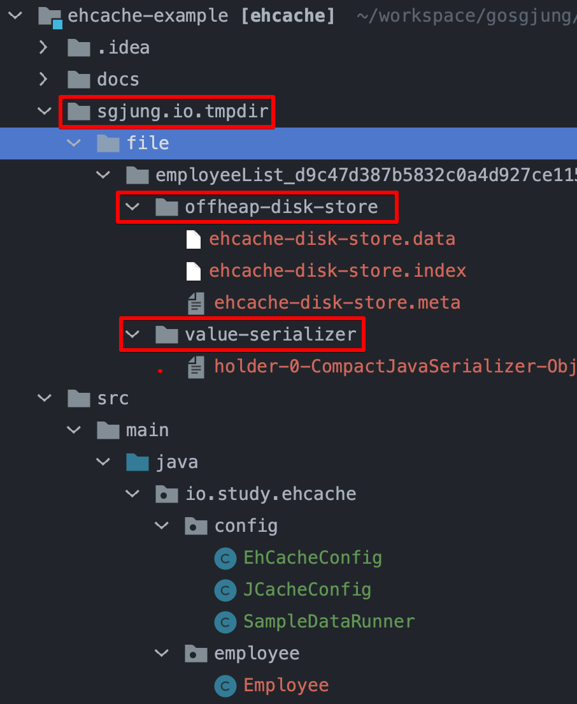
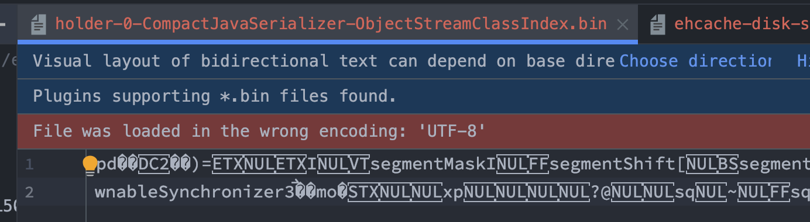
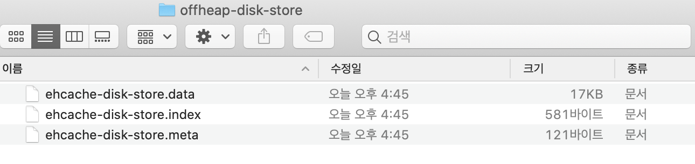

# EhCache 3 연동하기


## 의존성 추가

- spring-boot-starter-cache

- ehcache<br>

  - org.ehcache.ehcache
  - 주의(org.ehcache.ehcache 이다. 그리고 3.x 버전을 선택하자.)

- cache-api 

<bR>

```xml
<dependency>
    <groupId>org.springframework.boot</groupId>
    <artifactId>spring-boot-starter-cache</artifactId>
</dependency>

<dependency>
    <groupId>org.ehcache</groupId>
    <artifactId>ehcache</artifactId>
    <version>3.8.0</version>
</dependency>

<dependency>
    <groupId>javax.cache</groupId>
    <artifactId>cache-api</artifactId>
    <version>1.0.0</version>
</dependency>
```

<br>

## echache.xml

일단은, 캐시의 만료기한은 없도록 했다. 그 외의 listener, event 관련 설정은 일단 하지 않고 heap 과 offheap 설정만을 해두었다. offheap 은 JVM이 관리하는 힙 메모리가 아닌 메모리를 의미한다. 디스크보다는 IO 속도가 빠르고, RAM 같은 메모리보다는 조금 속도가 느린 영역의 메모리이다.<br>

운영체제 이론에서 이야기하는 가상 메모리 매핑을 구현한 것이 offheap 인 것으로 보인다. 실제로 LRU, FIFO 등의 개념이 나오는 것으로 보아 그런 것으로 보인다. (명확하게 설명하는 곳이 없어서 확실하지는 않지만, 추측하자면, 카프카처럼 페이지 캐시를 이용하는 것으로 보인다.)

```xml
<config xmlns:xsi="http://www.w3.org/2001/XMLSchema-instance"
        xmlns="http://www.ehcache.org/v3"
        xmlns:jsr107="http://www.ehcache.org/v3/jsr107"
        xsi:schemaLocation="
            http://www.ehcache.org/v3 http://www.ehcache.org/schema/ehcache-core-3.0.xsd
            http://www.ehcache.org/v3/jsr107 http://www.ehcache.org/schema/ehcache-107-ext-3.0.xsd">

    <cache alias="employeeList">
        <key-type>java.lang.String</key-type>
        <value-type>io.study.ehcache.employee.Employee</value-type>
        <expiry>
            <none/>
<!--            <ttl unit="seconds">30</ttl>-->
        </expiry>

<!--        <listeners>-->
<!--            <listener>-->
<!--                <class>com.baeldung.cachetest.config.CacheEventLogger</class>-->
<!--                <event-firing-mode>ASYNCHRONOUS</event-firing-mode>-->
<!--                <event-ordering-mode>UNORDERED</event-ordering-mode>-->
<!--                <events-to-fire-on>CREATED</events-to-fire-on>-->
<!--                <events-to-fire-on>EXPIRED</events-to-fire-on>-->
<!--            </listener>-->
<!--        </listeners>-->

        <resources>
            <heap unit="entries">1000</heap>
            <offheap unit="MB">10</offheap>
        </resources>
    </cache>

</config>
```

<br>

캐시에 저장할 자료구조는 `employeeList` 라는 이름의 자료구조이다. `key` 는 Employee의  name 이고, `value` 에 매칭되는 값은 Employee 객체이다.<br>

## application.properties

Application.properties 는 아래와 같이 작성하자.

```properties
spring.cache.jcache.config=classpath:ehcache.xml
spring.main.allow-bean-definition-overriding=true
```

<br>

- `spring.cache.jcache.config=classpath:ehcache.xml`
  - Ehcache 에 관련된 설정 xml 파일이 있는 디렉터리의 경로를 지정해주는 속성은 `spring.cache.jcache.config` 이다.
- `spring.main.allow-bean-definition-overriding=true` 
  - 스프링 부트가 해주는 자동설정을 그대로 따라가지 않고 필요한 설정을 오버라이딩해서 사용할 것이기 때문에 `spring.main.allow-bean-definition-overriding` 속성에 대한 값을 true 로 세팅해주었다.

<br>

## JCacheConfig.java

참고자료

- https://www.ehcache.org/documentation/3.0/getting-started.html
- [www.ehcache.org - Configuring with Java](https://www.ehcache.org/documentation/3.0/getting-started.html#configuring-with-java)

파일명을 JCacheConfig.java라고 지었다. 별다른 의미는 없고 지을 이름이 없어서 JCacheConfig 라는 이름으로 클래스를 생성했다. 설정의 대부분의 내용은 [www.ehcache.org - Configuring with Java](https://www.ehcache.org/documentation/3.0/getting-started.html#configuring-with-java) 을 참고해서 작성했다.<br>

인스턴스 생성 로직을 여러개의 Bean으로 나누어야 하는데, 예제 수준인데 그렇게 나눠둘 필요가 있나 싶어서 그냥 두었다. 이 외에도 예제를 나중에 봤을 때 직관적으로 이해하는게 낫다는 생각이 들어서 따로 분리해두지는 않았다.

```java
package io.study.ehcache.config;

import org.ehcache.CacheManager;
import org.ehcache.config.CacheConfiguration;
import org.ehcache.config.builders.CacheConfigurationBuilder;
import org.ehcache.config.builders.CacheManagerBuilder;
import org.ehcache.config.builders.ExpiryPolicyBuilder;
import org.ehcache.config.builders.ResourcePoolsBuilder;
import org.ehcache.config.units.EntryUnit;
import org.ehcache.config.units.MemoryUnit;
import org.springframework.cache.annotation.EnableCaching;
import org.springframework.cache.jcache.JCacheCacheManager;
import org.springframework.cache.jcache.JCacheManagerFactoryBean;
import org.springframework.context.annotation.Bean;
import org.springframework.context.annotation.Configuration;

import io.study.ehcache.employee.Employee;

@EnableCaching
@Configuration
public class JCacheConfig {

	@Bean(name = "employeeCacheManager")
	public CacheManager cacheManager(){
		final CacheConfiguration<String, Employee> cacheConfigBuilder = CacheConfigurationBuilder
			.newCacheConfigurationBuilder(
				String.class, Employee.class,
				ResourcePoolsBuilder.newResourcePoolsBuilder()
					// .heap(10) // 정말 간단하게 하려면 아래 세줄 대신 이 한줄로 하면 된다. (대신 디스크 설정 및 여러가지 사항들은 세부적으로 설정 불가)
					.heap(10, EntryUnit.ENTRIES)
					.offheap(1, MemoryUnit.MB)
					.disk(20, MemoryUnit.MB, true)
			)
			.withExpiry(ExpiryPolicyBuilder.noExpiration())
			.build();

		final CacheManager cacheManager = CacheManagerBuilder.newCacheManagerBuilder()
			.with(CacheManagerBuilder.persistence("sgjung.io.tmpdir"))
			.withCache("employeeList", cacheConfigBuilder)
			.build();

		cacheManager.init();

		return cacheManager;
	}
}
```

<br>

`TODO` : 생각해보니 설명도 어느 정도는 정리해둘 필요가 있을 것 같다. 설명을 추가하는 것은 이번주 화요일 ~ 목요일 사이에 해야 할 것 같다. 오늘은 일단 예제를 빨리 정리해두는 것이 목적이다.<br>

## 예제 로직 추가

예제는 EmployeeService 에서 데이터를 가져오는 예제이다. 역시 노동자는 어쩔 수 없다. 가장 먼저 떠오르는 클래스가 Employee 다...<br>

### Employee.java 

주의할 점은 Serializable 을 implements 해야 한다는 점이다. 디스크에 저장해야하므로 직렬화해서 저장하고, 다시 디스크에서 꺼내올 때는 역직렬화해서 가져와야 하기 때문이다. 이렇게 디스크에 저장하게 되는 이유는 위에서 설정한 off-heap 설정때문이다. off-heap을 사용하는 것의 장점에 대한 참고자료는 아래에 정리해두었다.

```java
package io.study.ehcache.employee;

import java.io.Serializable;

import lombok.AllArgsConstructor;
import lombok.Builder;
import lombok.Getter;
import lombok.Setter;
import lombok.ToString;

@ToString
@AllArgsConstructor
@Builder
@Getter @Setter
public class Employee implements Serializable {
	private String name;
	private Double salary;
}
```

<br>

### EmployeeService.java

```java
package io.study.ehcache.employee;

import java.util.List;

public interface EmployeeService {
	List<Employee> findAllEmployees();
}
```

<br>

### EmployeeServiceImpl.java

별다른 내용은 없다. 전체 직원들의 리스트를 모두 불러오는 `findAllEmployees()` 메서드로 모든 직원들을 불러와서 반환하고 있다.

```java
package io.study.ehcache.employee;

import java.util.Arrays;
import java.util.List;

import org.ehcache.Cache;
import org.ehcache.CacheManager;
import org.springframework.beans.factory.annotation.Qualifier;
import org.springframework.cache.annotation.Cacheable;
import org.springframework.stereotype.Service;

@Service
public class EmployeeServiceImpl implements EmployeeService{

	private final CacheManager cacheManager;

	public EmployeeServiceImpl(@Qualifier("employeeCacheManager") CacheManager cacheManager){
		this.cacheManager = cacheManager;
	}

  // ...
  
	@Override
	public List<Employee> findAllEmployees() {
		Employee e1 = Employee.builder().name("지드래곤").salary(99999D).build();
		Employee e2 = Employee.builder().name("손흥민").salary(99999D).build();
		Employee e3 = Employee.builder().name("황의조").salary(99997D).build();

		return Arrays.asList(e1, e2, e3);
	}

  // ...
  
}
```

<br>

이제 이 메서드를 기반으로 테스트를 해본 결과를 정리해보면 아래와 같다.

## 테스트 코드

`org.ehcache.Cache` 와 `org.ehcache.CacheManager` 를 사용한 것에 주의하자. 스프링 부트를 사용하게 되면 Cache 에 관련된 라이브러리가 많아서 헷갈린다. (직접 이것 저것 설정을 실패하면서 테스트해본 결과  Springframework 의 Cache 인터페이스를 타입으로 해서 받아서 사용하는 것은 ehcache2.x 대의 설정인 것으로 보인다.)<br>

테스트의 시나리오는 이렇다.

- 캐시에서 직원이름이 "손흥민"인 직원을 조회한다.
  - 그리고 캐시에는 아직 "손흥민" 직원이 없기 때문에 cache 조회 값은 null 이어야한다.
- 전체 직원들의 리스트를 불러온다.
- 불러온 직원들 각각을 캐시에 넣는다.
  - `cache.put(e.getName(), e);`
- 캐시에서 "손흥민"직원을 꺼내본다.
  - 꺼내온 "손흥민"직원이 있다면 정상동작이기에 isNotNull() 을 assertion 했다.

<br>

```java
package io.study.ehcache.config;
// ...
import org.ehcache.Cache;
import org.ehcache.CacheManager;
import org.junit.jupiter.api.Test;
// ...

@SpringBootTest
public class CacheConnectionTest {

	@Autowired
	@Qualifier("employeeCacheManager")
	private CacheManager cacheManager;

	@Autowired
	private EmployeeService employeeService;

	@Test
	public void 캐시동작테스트(){
		Cache<String, Employee> cache = cacheManager.getCache("employeeList", String.class, Employee.class);
		Employee beforeCache = cache.get("손흥민");
		assertThat(beforeCache).isNull();

		List<Employee> employeeList = employeeService.findAllEmployees();
		for(Employee e : employeeList){
			cache.put(e.getName(), e);
		}

		Employee afterCache = cache.get("손흥민");
		assertThat(afterCache).isNotNull();
	}
}
```

<br>

## 로컬 디스크 (off-heap) 내의 직렬화된 데이터 확인

로컬 디스크를 확인해보면 아래와 같이 디렉터리가 하나 생성되어 있다.



<br>

설정 파일에 지정했던 대로 `sgjung.io.tmpdir` 디렉터리 내를 찾아보면 `offheap-disk-store` , 

`value-serializer` 디렉터리가 생성되었음을 확인할 수 있다. 그리고 그 안을 살펴보면 여러가지 파일이 생성되어 있는데 그 중 하나의 파일을 열어보면 아래 그림 처럼 뭔가 텍스트를 직렬화한 모습이 보인다.<br>



<br>

Employee 객체 3개를 저장했을 때의 로컬 데이터 파일들의 크기를 직접 확인해보면 아래와 같다. 



약  17kb 정도 되는 것을 확인할 수 있다. 만약 Employee 의 갯수가 1000 개가 된다면 17MB의 사이즈를 차지하게 되겠다.<br>

TODO : 직접 for 문으로 1000 개의 Employee 를 생성해서 파일크기를 확인해보기<br>

